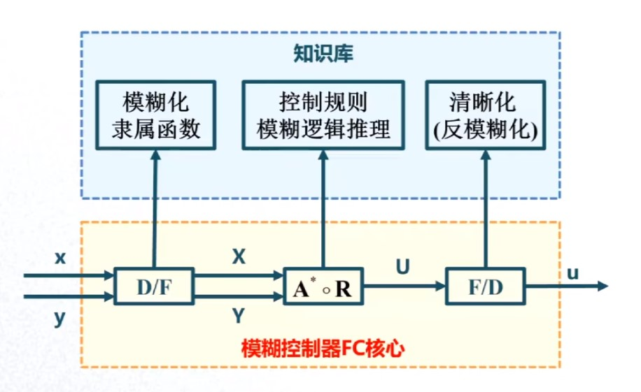
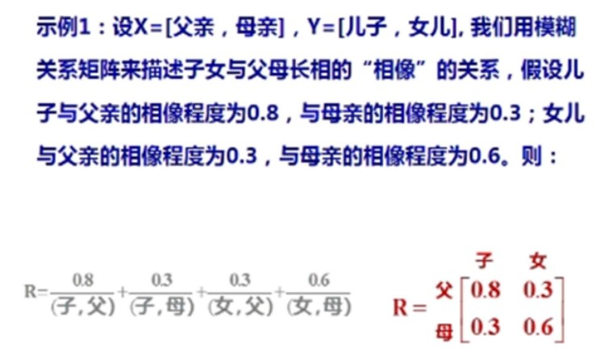
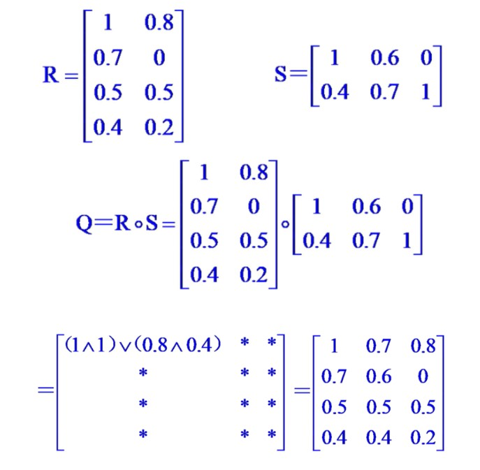
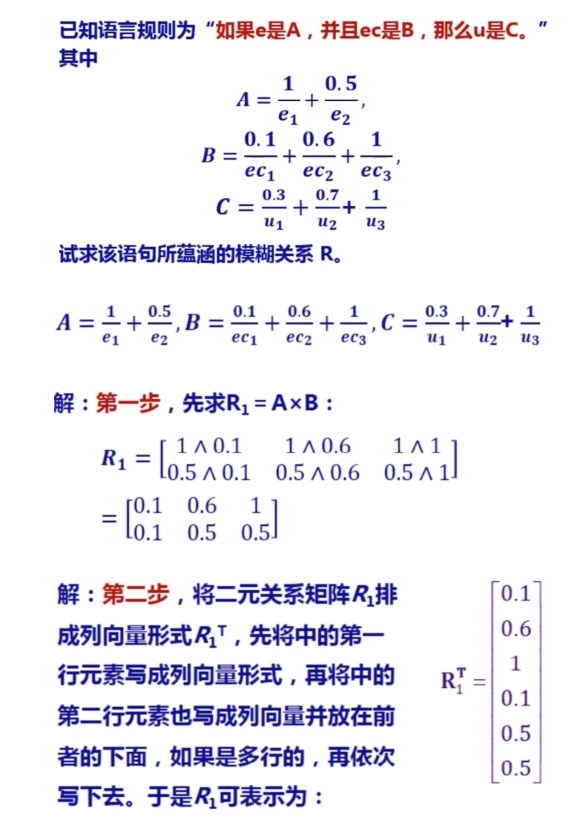
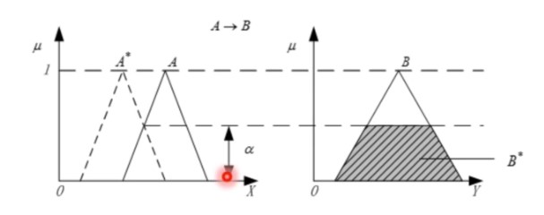
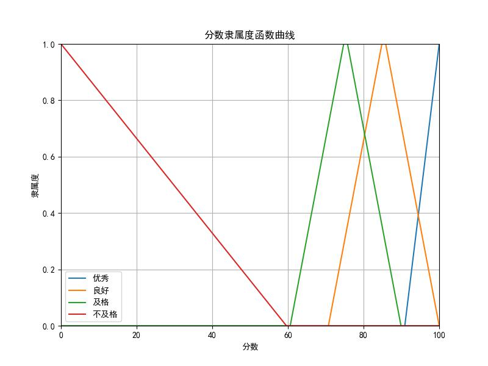

# 模糊控制（Fuzzy Control）

模糊控制是一种可以实现多输入单输出、多输入多输出的控制算法，它通常用于取代传统控制算法中的控制器（此处对应于多输入单输出，多输入得益于其前方的比较环节），从而在一定程度上综合利用各个输入条件。

# 目录

- [模糊控制（Fuzzy Control）](#模糊控制fuzzy-control)
- [目录](#目录)
- [控制器核心](#控制器核心)
- [相关数学符号说明](#相关数学符号说明)
- [相关概念](#相关概念)
  - [论域](#论域)
  - [模糊集合](#模糊集合)
    - [模糊集合关系](#模糊集合关系)
    - [模糊集合的表示方式](#模糊集合的表示方式)
    - [模糊集合的运算](#模糊集合的运算)
  - [隶属函数](#隶属函数)
    - [笛卡尔积](#笛卡尔积)
  - [模糊关系矩阵](#模糊关系矩阵)
  - [模糊关系合成](#模糊关系合成)
  - [模糊变换](#模糊变换)
  - [模糊推理](#模糊推理)
    - [模糊推理规则](#模糊推理规则)
    - [模糊推理合成](#模糊推理合成)
- [模糊控制](#模糊控制)
  - [总体概括](#总体概括)
    - [编程建议](#编程建议)
  - [模糊化](#模糊化)
- [参考资料](#参考资料)

# 控制器核心

以两个输入变量一个输出变量为例对模糊控制的控制器核心进行说明：

$D/F$：将输入数据进行模糊化处理

$A^{*} \circ R$：进行控制规则模糊推理

$F/D$：将模糊数据转换成控制数据

经过以上单元，便将多输入数据处理成了控制数据，提供给后续的执行机构等部分。

# 相关数学符号说明

1. 模糊化运算符：$\circ$
2. 两者之间取大值：$\vee$
3. 两者之间取小值：$\wedge$

# 相关概念

理解相关概念，能够使我们更加准确的理解模糊控制。

## 论域

被考虑对象的全体，如XXX小区居民的年龄。

## 模糊集合

模糊集合就是对于特定论域中元素的一个模糊的“划分”，因为它是模糊的，所以我们无法得到一个准确的描述或者值，只能通过隶属函数得到元素隶属于这个模糊集合的程度，即隶属度。就拿上述论域所举例子来说，“XXX小区的居民是年轻人”就是这个论域的一个模糊集合，我们无法准确的说这个人就是年轻人，只能说这个人的年轻程度是多少。

### 模糊集合关系

1. 相等

$\quad \enspace$ 设$A$和$B$均为$X$上的模糊集，如果对$\forall{x} \in X$，均有

$$\mu_{A}(x) = \mu_{B}(x)$$

$\quad \enspace$ 则称$A$和$B$相等。

2. 包含于

$\quad \enspace$ 设$A$和$B$均为$X$上的模糊集，如果对$\forall{x} \in X$，均有

$$\mu_{A}(x) \leq \mu_{B}(x)$$

$\quad \enspace$ 则称$A$包含于$B$，记作$A \subseteq B$。

### 模糊集合的表示方式

1. 向量表示法

$\quad \enspace$ 当论域$X$为有限点集$X=\left\{x_{1},x_{2},...,x_{n}\right\}$时，$X$上的模糊集可以用向量$A$来表示，即

$$A=(\mu_{1},\mu_{2},...,\mu_{n}) \quad \mu_{i}=A(x_{i}),i=1,2,...,n$$

2. Zadeh表示法

$\quad \enspace$ 给定有限论域$X=\left\{x_{1},x_{2},...,x_{n}\right\}$，$A$为$X$上的模糊集合

$$A=\frac{\mu_{1}}{x_{1}}+\frac{\mu_{2}}{x_{2}}+...+\frac{\mu_{n}}{x_{n}}$$

$\quad \enspace$ 其中$\frac{\mu_{i}}{x_{i}}$并不表示“分数”，而是论域中的元素与其隶属函数$A(x_{i})$之间的对应关系。

3. 序偶表示法

$\quad \enspace$ 将论域中的元素$x_{i}$与其隶属度函数$A(x_{i})$构成序偶来表示$A$，则

$$A=\left\{(x_{1},A(x_{1})),(x_{2},A(x_{2})),...,(x_{n},A(x_{n}))\right\}$$

### 模糊集合的运算

1. 并集

$$\mu_{A \cup B}(x)=\mu_{A}(x) \vee \mu_{B}(x)$$

2. 交集

$$\mu_{A \cap B}(x)=\mu_{A}(x) \wedge \mu_{B}(x)$$

3. 补集

$$\mu_{A^{c}}(x)=1 - \mu_{A}(x)$$

## 隶属函数

有论域$X$，及定义在$X$上的模糊集合$A$，对于$\forall{x} \in X$，定义实值函数$\mu_{A}(x) \in [0,1]$为$x$属于$A$的隶属度，$\mu_{A}(x)$也称为隶属函数。

可见一个模糊集合是定义在一个论域上的，能通过隶属函数来描述论域中的元素符合这个模糊集合的程度。

### 笛卡尔积

对于集合的笛卡尔积，是指给定两个集合$X$和$Y$，由全体$(x,y) \enspace (x \in X,y \in Y)$组成的集合，叫作$X$与$Y$的笛卡尔积（或称直积），记作$X \times Y$

$$X \times Y=\left\{(x,y)|x \in X,y \in Y\right\}$$

## 模糊关系矩阵

模糊关系矩阵用于描述两个集合之间的模糊关系，例如：

## 模糊关系合成

由第一个集合和第二个集合之间的模糊关系，及第二个集合和第三个集合之间的模糊关系，得到第一个集合和第三个集合之间的模糊关系的一种运算。

其运算规律为：设$R$是$X \times Y$中的模糊关系，$S$是$Y \times Z$中的模糊关系，所谓$R$和$S$的合成是指下列定义在$X \times Z$上的模糊关系$Q$，记作

$$Q=R \circ S$$

或

$$\mu_{R \circ S}(x,z)= \vee \left\{\mu_{R}(x,y) \wedge \mu_{S}(y,z)\right\}$$

下面给出一个具体的运算过程，可以发现和举证运算是类似的。

## 模糊变换

已知两个集合之间的模糊关系，有一个集合上的模糊子集经过运算得到另一个集合上的模糊子集。如：从输入的模糊量求输出的模糊量。

设有限集$X=\left\{x_{1},x_{2},...,x_{m}\right\} \enspace Y=\left\{y_{1},y_{2},...,y_{n}\right\}$，$R$是$X \times Y$上的模糊关系，$A$和$B$分别为$X$和$Y$上的模糊集，且满足

$$B=A \circ R$$

则称$B$是$A$的象，$A$是$B$的原象，上式称为$X$到$Y$上的一个模糊变换。

## 模糊推理

### 模糊推理规则

类似于概率论中的处理方法，需要考虑矩阵形式，且认为是独立分布的。

$e.g.$ $\enspace$ $P(B|A)$

$\qquad$ 设$A \in F(U),B \in F(V)$，模糊条件语句为“如果A，则B”，这个推理规则用模糊关系R表示为

$$R=A \times B=A^{T} \circ B$$
$$R(u,v)=A(u) \wedge B(v)$$
$$\mu_{R}(u,v)=\mu_{A}(u) \wedge \mu_{B}(v)$$

$\qquad$此即Mamdani推理。上式中，$A$和$B$都是行向量。

可以发现的是，求得两个模糊子集的直积之后，得到的是一个矩阵$R$，那么如果需要将这个矩阵$R$运用于计算式中进一步计算，是否还要和线性代数中一样操作呢？事实是否定的，如果还需要求直积，应该将矩阵的各行的元素顺序排列成一行的行矢量再转至之后进行运算，其表达式如下：

$$R=A \times E \times B=\overrightarrow{(A^{T} \circ E)}^{T} \circ B$$

实例如下：

### 模糊推理合成

一般来说模糊控制要先根据模糊推理规则来综合已知数据建立一个`规则库`，然后给定一个模糊输入，再求其在规则库下对应的模糊输出。所以，给定输入，并根据得到的模糊关系矩阵$R$求出其输出的过程就是模糊推理合成。这里需要注意的是：给定的输入和得到的输出都用“\*”表示，不带“\*”的量表示已知数据，用来推导模糊关系矩阵。

简单来说，我们需要根据已知的数据建立模型$R$，然后对输入的数据$A^{*}$进行模糊推理得到输出数据$B^{*}$，这个过程类似于自动控制理论中的内容，其实，模糊推理也可以用于自动控制系统中。

实例：

已知$A=\frac{1}{e_{1}}+\frac{0.5}{e_{2}}，B=\frac{0.1}{ec_{1}}+\frac{0.6}{ec_{2}}+\frac{1}{ec_{3}}$，如果$A$，则$B$。当$A^{*}=\frac{0.8}{e_{1}}+\frac{0.4}{e_{2}}$，求$B^{*}$。

$$R=A \times B=A^{T} \circ B=\begin{bmatrix}
  0.1 & 0.6 & 1 \\
  0.1 & 0.5 & 0.5
\end{bmatrix}$$
$$B^{*}=A^{*} \circ R=\begin{bmatrix}
  0.8 & 0.4
\end{bmatrix} \circ \begin{bmatrix}
  0.1 & 0.6 & 1 \\
  0.1 & 0.5 & 0.5
\end{bmatrix}=\begin{bmatrix}
  0.1 & 0.6 & 0.8
\end{bmatrix}$$

这个问题还可以使用如下方法：

$$B^{*}(y)=A^{*}(x) \circ R(x,y)$$
$$\mu_{B^{*}}(y)= \vee_{x \in X}\left\{\mu_{A^{*}}(x) \wedge [\mu_{A}(x) \wedge \mu_{B}(y)]\right\}= \vee_{x \in X}[\mu_{A^{*}}(x) \wedge \mu_{A}(x)] \wedge \mu_{B}(y)= \alpha \wedge \mu_{B}(y)$$

其中，$\alpha = \vee_{x \in X}[\mu_{A^{*}}(x) \wedge \mu_{A}(x)]$，相当于是一个行向量和一个列向量相乘，得到的是一个数，在这里叫$A^{*}$和$A$的`适配度`。是$A^{*}$和$A$交集的高度。

# 模糊控制

## 总体概括

通过模糊控制器按照一定的准则将输入的数据转换成模糊数据（一系列的向量），然后对这些模糊数据进行推理得到模糊控制信号，再反模糊化得到实际使用的控制信号。

### 编程建议

1. 由以上概括性的语言，我们知道这是一个多输入单输出的模型，但是有时也可以是多输出的。如果想要设计的模型具有更好的泛化能力，需要将其设计成模板的形式，而在单片机编程中，通常使用C语言，C语言没有提供模板特性或语法，因此只能仿照模板设计一种阉割之后的模板。
2. 我们发现输入数据和输出数据通常是一个数字量，所以可以使用数组来实现数据的输入，在输出数据时，我们需要给模糊控制API传递一个数据接收缓冲区用于接收解算得到的控制信号数据。
3. 不同系统中的FC通常不是一样的，我们也不能事先为各个系统设计专用或通用的控制算法，需要用户自己编写回调函数实现数据的模糊函数、模糊推理、反模糊化等过程。
4. 为了使用方便，需要以面向对象的思想进行FC的设计，不过我们并不提供对象中设置输入数据寄存器的功能，因为C语言使用结构体实现面向对象并不向方法传递对象的引用。

## 模糊化

模糊化就是将输入的精确值模糊化成为模糊子集，这样就将不同量纲的数据统一成了同一量纲，方便后续的操作。

通常一个模态的数据有一个评判标准，比如100分的试卷，我可以认为其评判准则如下：

| 等级 | 分数 |
| - | - |
| 优秀 | ≥90 |
| 良好 | ≥70 |
| 及格 | ≥60 |
| 不及格 | <60 |

其对应的隶属函数曲线如图所示：

可见，当分数取到一个允许的特定值时，可以得到带有4个隶属度元素的隶属度向量，比如当分数为80时，隶属度向量为`[0 0.67 0.67 0]`，这是从“优秀”开始计算的，当然也可以从“不及格”开始排序，显然这个隶属函数是不合适的，为了方便，我就不再修改了。

类似地，我们将其他输入数据进行模糊化，别忘了也要模糊化输出数据，在这你可能就有疑问了，输出数据不是还没有被计算出来吗，为什么要对它进行模糊化呢？
TODO(me)解释为什么需要对输出数据进行模糊化
模糊化输出数据同样要建立一套隶属函数，
TODO(me)完善输出数据模糊化过程

# 参考资料

1. [【入门】智能控制 | 20分钟搞定模糊控制](https://www.bilibili.com/video/BV1LF411B7h6/?share_source=copy_web&vd_source=6cc0d29d53534db0b6fe68e1a43abf47)
2. [【学习笔记】模糊控制算法](http://t.csdnimg.cn/9wnB8)
