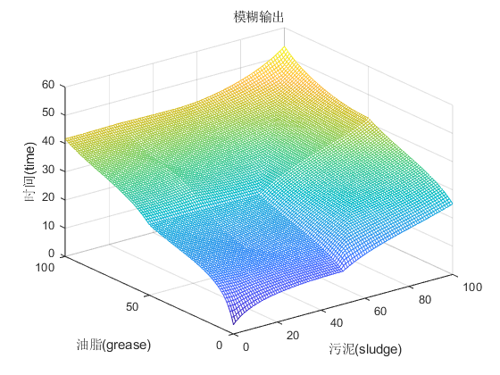
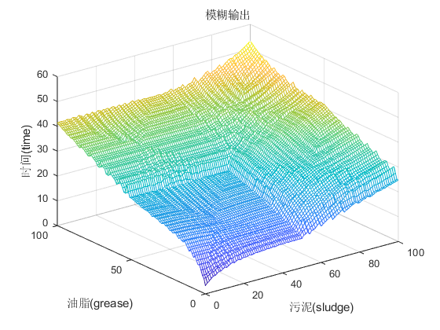
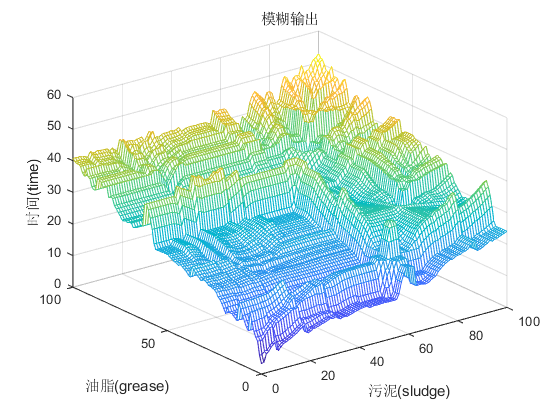

# 不同精度下的模糊输出

- [不同精度下的模糊输出](#不同精度下的模糊输出)
  - [1E-1f](#1e-1f)
  - [1E-2f](#1e-2f)
  - [1E-3f](#1e-3f)
  - [1E-4f](#1e-4f)
  - [1E-5f](#1e-5f)
  - [2E-6f](#2e-6f)
  - [结论](#结论)

## 1E-1f

平均绝对相对误差：17.6062%

## 1E-2f

平均绝对相对误差：17.6242%

## 1E-3f

平均绝对相对误差：17.6241%

## 1E-4f

平均绝对相对误差：17.6265%

## 1E-5f

平均绝对相对误差：18.1062%

## 2E-6f

平均绝对相对误差：19.6609%

## 结论

使用精度为`1E-1f`时，误差最小。
