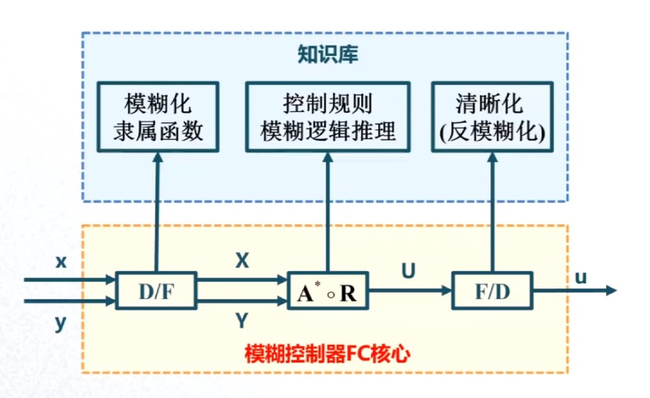
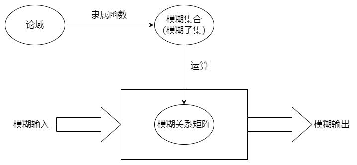
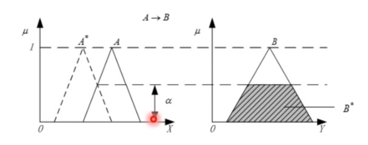
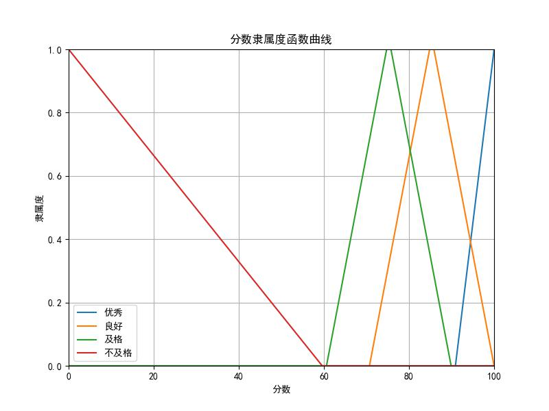

# 模糊控制（Fuzzy Control）

模糊控制是一种可以实现多输入单输出、多输入多输出的控制算法，它通常用于取代传统控制算法中的控制器（此处对应于多输入单输出，多输入得益于其前方的比较环节），从而在一定程度上综合利用各个输入条件。

- [模糊控制（Fuzzy Control）](#模糊控制fuzzy-control)
  - [1. 控制器核心](#1-控制器核心)
  - [2. 相关数学符号说明](#2-相关数学符号说明)
  - [3. 相关概念](#3-相关概念)
    - [3.1 论域](#31-论域)
    - [3.2 模糊集合](#32-模糊集合)
      - [3.2.1 模糊集合关系](#321-模糊集合关系)
      - [3.2.2 模糊集合的表示方式](#322-模糊集合的表示方式)
      - [3.2.3 模糊集合的运算](#323-模糊集合的运算)
    - [3.3 隶属函数](#33-隶属函数)
      - [3.3.1 笛卡尔积](#331-笛卡尔积)
    - [3.4 模糊关系矩阵](#34-模糊关系矩阵)
    - [3.5 模糊关系合成](#35-模糊关系合成)
    - [3.6 模糊变换](#36-模糊变换)
    - [3.7 模糊推理](#37-模糊推理)
      - [3.7.1 模糊推理规则](#371-模糊推理规则)
      - [3.7.2 模糊推理合成](#372-模糊推理合成)
    - [3.8 规则库](#38-规则库)
  - [4. 模糊控制过程](#4-模糊控制过程)
    - [4.1 输入模糊化](#41-输入模糊化)
    - [4.2 模糊决策](#42-模糊决策)
      - [4.2.1 综合法](#421-综合法)
      - [4.2.2 并行法](#422-并行法)
      - [4.2.3 模糊决策举例](#423-模糊决策举例)
      - [4.2.4 更适合的模糊决策](#424-更适合的模糊决策)
    - [4.3 输出逆模糊化（清晰化）](#43-输出逆模糊化清晰化)
  - [参考资料](#参考资料)

## 1. 控制器核心

以两个输入变量一个输出变量为例对模糊控制的控制器核心进行说明：

$D/F$：将输入数据进行模糊化处理

$A^{*} \circ R$：进行控制规则模糊推理

$F/D$：将模糊数据转换成控制数据

经过以上单元，便将多输入数据处理成了控制数据，提供给后续的执行机构等部分。

## 2. 相关数学符号说明

1. 模糊化运算符：$\circ$
2. 两者之间取大值：$\vee$
3. 两者之间取小值：$\wedge$

## 3. 相关概念

理解相关概念，能够使我们更加准确的理解模糊控制。

### 3.1 论域

被考虑对象的全体，如XXX小区居民的年龄。

### 3.2 模糊集合

模糊集合就是对于特定论域中元素的一个模糊的“划分”，因为它是模糊的，所以我们无法得到一个准确的说法，即无法得到1或者0这样的二元值，只能通过隶属函数得到元素隶属于这个模糊集合的程度，即隶属度。就拿上述论域所举例子来说，“XXX小区的居民是年轻人”就是这个论域的一个模糊集合，我们无法准确的说这个人就是年轻人，只能说这个人的年轻程度是多少。

#### 3.2.1 模糊集合关系

1. 相等
$\\$ 设$A$和$B$均为$X$上的模糊集，如果对$\forall{x} \in X$，均有
$$\mu_{A}(x) = \mu_{B}(x)$$
$\\$ 则称$A$和$B$相等。

2. 包含于
$\\$ 设$A$和$B$均为$X$上的模糊集，如果对$\forall{x} \in X$，均有
$$\mu_{A}(x) \leq \mu_{B}(x)$$
$\\$ 则称$A$包含于$B$，记作$A \subseteq B$。

#### 3.2.2 模糊集合的表示方式

1. 向量表示法
$\\$ 当论域$X$为有限点集$X=\left\{x_{1},x_{2},...,x_{n}\right\}$时，$X$上的模糊集可以用向量$A$来表示，即
$$A=(\mu_{1},\mu_{2},...,\mu_{n}) \quad \mu_{i}=A(x_{i}),i=1,2,...,n$$

2. Zadeh表示法
$\\$ 给定有限论域$X=\left\{x_{1},x_{2},...,x_{n}\right\}$，$A$为$X$上的模糊集合
$$A=\frac{\mu_{1}}{x_{1}}+\frac{\mu_{2}}{x_{2}}+...+\frac{\mu_{n}}{x_{n}}$$
$\\$ 其中$\frac{\mu_{i}}{x_{i}}$并不表示“分数”，而是论域中的元素与其隶属函数$A(x_{i})$之间的对应关系。

3. 序偶表示法
$\\$ 将论域中的元素$x_{i}$与其隶属度函数$A(x_{i})$构成序偶来表示$A$，则
$$A=\left\{(x_{1},A(x_{1})),(x_{2},A(x_{2})),...,(x_{n},A(x_{n}))\right\}$$

#### 3.2.3 模糊集合的运算

1. 并集
$$\mu_{A \cup B}(x)=\mu_{A}(x) \vee \mu_{B}(x)$$

2. 交集
$$\mu_{A \cap B}(x)=\mu_{A}(x) \wedge \mu_{B}(x)$$

3. 补集
$$\mu_{A^{c}}(x)=1 - \mu_{A}(x)$$

### 3.3 隶属函数

有论域$X$，及定义在$X$上的模糊集合$A$，对于$\forall{x} \in X$，定义实值函数$\mu_{A}(x) \in [0,1]$为$x$属于$A$的隶属度，$\mu_{A}(x)$也称为隶属函数。

可见一个模糊集合是定义在一个论域上的，能通过隶属函数来描述论域中的元素符合这个模糊集合的程度。

#### 3.3.1 笛卡尔积

对于集合的笛卡尔积，是指给定两个集合$X$和$Y$，由全体$(x,y) \enspace (x \in X,y \in Y)$组成的集合，叫作$X$与$Y$的笛卡尔积（或称直积），记作$X \times Y$
$$X \times Y=\left\{(x,y)|x \in X,y \in Y\right\}$$

### 3.4 模糊关系矩阵

模糊关系矩阵用于描述两个集合之间的模糊关系，例如：

### 3.5 模糊关系合成

由第一个集合和第二个集合之间的模糊关系，及第二个集合和第三个集合之间的模糊关系，得到第一个集合和第三个集合之间的模糊关系的一种运算。

其运算规律为：设$R$是$X \times Y$中的模糊关系，$S$是$Y \times Z$中的模糊关系，所谓$R$和$S$的合成是指下列定义在$X \times Z$上的模糊关系$Q$，记作
$$Q=R \circ S$$
或
$$\mu_{R \circ S}(x,z)= \vee \left\{\mu_{R}(x,y) \wedge \mu_{S}(y,z)\right\}$$

下面给出一个具体的运算过程，可以发现和矩阵运算是类似的。

### 3.6 模糊变换

已知两个集合之间的模糊关系，由一个集合上的模糊子集经过运算得到另一个集合上的模糊子集。如：从输入的模糊量求输出的模糊量。

设有限集$X=\left\{x_{1},x_{2},...,x_{m}\right\} \enspace Y=\left\{y_{1},y_{2},...,y_{n}\right\}$，$R$是$X \times Y$上的模糊关系，$A$和$B$分别为$X$和$Y$上的模糊集，且满足
$$B=A \circ R$$
则称$B$是$A$的象，$A$是$B$的原象，上式称为$X$到$Y$上的一个模糊变换。

### 3.7 模糊推理

#### 3.7.1 模糊推理规则

类似于概率论中的处理方法，需要考虑矩阵形式，且认为是独立分布的。

$e.g.$ $P(B|A)$
$\qquad$ 设$A \in F(U),B \in F(V)$，模糊条件语句为“如果A，则B”，这个推理规则用模糊关系R表示为
$$R=A \times B=A^{T} \circ B$$
$$R(u,v)=A(u) \wedge B(v)$$
$$\mu_{R}(u,v)=\mu_{A}(u) \wedge \mu_{B}(v)$$
$\qquad$此即Mamdani推理。上式中，$A$和$B$都是行向量。

可以发现的是，求得两个模糊子集的直积之后，得到的是一个矩阵$R$，那么如果需要将这个矩阵$R$运用于计算式中进一步计算，是否还要和线性代数中一样操作呢？事实是否定的，如果还需要求直积，应该将矩阵的各行的元素顺序排列成一行的行矢量再转至之后进行运算，其表达式如下：
$$R=A \times E \times B=\overrightarrow{(A^{T} \circ E)}^{T} \circ B$$

实例如下：

#### 3.7.2 模糊推理合成

一般来说模糊控制要先根据模糊推理规则来综合已知数据建立一个`规则库`，然后给定一个模糊输入，再求其在规则库下对应的模糊输出。所以，给定输入，并根据得到的模糊关系矩阵$R$求出其输出的过程就是模糊推理合成。这里需要注意的是：给定的输入和得到的输出都用“\*”表示，不带“\*”的量表示已知数据，用来推导模糊关系矩阵。

简单来说，我们需要根据已知的数据建立模型$R$，然后对输入的数据$A^{*}$进行模糊推理得到输出数据$B^{*}$，这个过程类似于自动控制理论中的内容，其实，模糊推理也可以用于自动控制系统中。

实例：
$\\$已知$A=\frac{1}{e_{1}}+\frac{0.5}{e_{2}}，B=\frac{0.1}{ec_{1}}+\frac{0.6}{ec_{2}}+\frac{1}{ec_{3}}$，如果$A$，则$B$。当$A^{*}=\frac{0.8}{e_{1}}+\frac{0.4}{e_{2}}$，求$B^{*}$。

$$R=A \times B=A^{T} \circ B=\begin{bmatrix}
  0.1 & 0.6 & 1 \\
  0.1 & 0.5 & 0.5
\end{bmatrix}$$
$$B^{*}=A^{*} \circ R=\begin{bmatrix}
  0.8 & 0.4
\end{bmatrix} \circ \begin{bmatrix}
  0.1 & 0.6 & 1 \\
  0.1 & 0.5 & 0.5
\end{bmatrix}=\begin{bmatrix}
  0.1 & 0.6 & 0.8
\end{bmatrix}$$

这个问题还可以使用如下方法：
$$B^{*}(y)=A^{*}(x) \circ R(x,y)$$
$$\mu_{B^{*}}(y)= \bigvee_{x \in X}\left\{\mu_{A^{*}}(x) \wedge [\mu_{A}(x) \wedge \mu_{B}(y)]\right\}= \bigvee_{x \in X}[\mu_{A^{*}}(x) \wedge \mu_{A}(x)] \wedge \mu_{B}(y)= \alpha \wedge \mu_{B}(y)$$
其中，$\alpha = \bigvee_{x \in X}[\mu_{A^{*}}(x) \wedge \mu_{A}(x)]$，相当于是一个行向量和一个列向量相乘，得到的是一个数，在这里叫$A^{*}$和$A$的`适配度`。是$A^{*}$和$A$交集的高度。

### 3.8 规则库

## 4. 模糊控制过程

### 4.1 输入模糊化

输入模糊化就是将输入的精确值模糊化成为模糊子集，这样就将数据转换成了隶属度，方便后续的操作。

通常一个模态的数据有多个模糊子集，比如100分的试卷，我们可以认为其模糊子集如下如下：

| 等级 | 分数 |
| - | - |
| 优秀 | ≥90 |
| 良好 | ≥70 |
| 及格 | ≥60 |
| 不及格 | <60 |

其对应的隶属函数曲线可以选取如下形式：

可见，当分数取到一个允许的特定值时，可以得到带有4个隶属度元素的隶属度向量（模糊值向量），比如当分数为80时，隶属度向量为`[0 0.67 0.67 0]`或写成$A=[0 0.67 0.67 0]$，这是从“优秀”开始计算的，当然也可以从“不及格”开始排序，显然这个隶属函数是不合适的，为了方便，我就不再修改了。

注：在编程时，为了降低资源成本，可以使用数组来存储模糊值向量，如果需要知道隶属度对应的模糊子集，可以使用带有键值对的数据结构进行存储，或者建立一个“伪常量”数组标签，用于存放模糊子集的名称（伪常量数组标签用户只读，管理员可写）。

类似地，我们将其他输入数据进行模糊化。

### 4.2 模糊决策

所谓模糊决策，实质上就是前面提到的模糊推理、模糊变换等操作的组合。其目的在于根据已有数据推出模糊关系，并根据模糊输入得到模糊输出。但是这个考虑的前提一般是多规则问题。也因此衍生出了两种方法，或者说两种理念——综合法和并行法。

#### 4.2.1 综合法

事先求出所有模糊规则的模糊关系$R$，再根据模糊输入求出模糊输出。

#### 4.2.2 并行法

事先不求解模糊关系$R$，而是利用模糊输入与每条规则的前件进行匹配，确定规则的激励强度$\alpha$。这种方式的好处在于能清楚知道输出模糊集中每条规则所起到的作用的多少以及能够方便地添加、删除和修改规则。
$$\alpha = \bigvee_{x \in X}\{\mu_{A^{*}}(x) \wedge \mu_{A}(x)\}$$

在并行法中，也可以分为三种类型的模糊决策。

1. 最小运算规则型
$\\$ 单个规则输出值与激励强度相与，然后再取所有规则输出值的最大值。
$$\mu_{U^{*}}(v)= \max{(\alpha \wedge \mu_{U}(v))}$$

2. 乘积运算规则型
$\\$ 单个规则输出值与激励强度相乘，然后再取所有规则输出值的最大值。
$$\mu_{U^{*}}(v)= \max{(\alpha \cdot \mu_{U}(v))}$$

3. 状态评价函数型
这种方式和规则表达方式有很大关系。

#### 4.2.3 模糊决策举例

当有两个输入 $A1$ 和 $A2$ 时，我们通过模糊化得到两个向量
$$A_{1}^{*}= \begin{bmatrix}
  0.3 & 0.8 & 0
\end{bmatrix}$$
$$A_{2}^{*}= \begin{bmatrix}
  0.9 & 0.4
\end{bmatrix}$$
从而有
$$A^{*}=A_{1}^{*} \times A_{2}^{*} = \begin{bmatrix}
  0.3 & 0.3 \\
  0.8 & 0.4 \\
  0 & 0
\end{bmatrix}$$
假设输入与输出的模糊关系为
$$R=\begin{bmatrix}
  0 & 0.5 \\
  0.9 & 0.3 \\
  0.7 & 0.1 \\
  0.3 & 0.7 \\
  0.6 & 1.0 \\
  0 & 0.2 \\
\end{bmatrix}$$
故模糊输出
$$B=\overrightarrow{A^{*}} \circ R= \begin{bmatrix}
  0.7 & 0.4
\end{bmatrix}$$

综合法的重点也即难点是，找到一个合适的模糊关系。如果使用并行法，则要有一对效果很好的输入输出，这也是很难的。

#### 4.2.4 更适合的模糊决策

当有两个输入 $A1$ 和 $A2$ 时，我们通过模糊化得到两个向量
$$A_{1}^{*}= \begin{bmatrix}
  0.3 & 0.8 & 0.2
\end{bmatrix}$$
$$A_{2}^{*}= \begin{bmatrix}
  0.9 & 0.4
\end{bmatrix}$$
从而有
$$A^{*}=A_{1}^{*} \times A_{2}^{*} = \begin{bmatrix}
  0.3 & 0.3 \\
  0.8 & 0.4 \\
  0.2 & 0.2
\end{bmatrix}$$
这是所有输入的所有模糊集合的所有不同组合，在这里我们可以将规则库（Rule library）定义成同型的矩阵，如下所示
$$R= \begin{bmatrix}
  r_{11} & r_{12} \\
  r_{21} & r_{22} \\
  r_{31} & r_{32}
\end{bmatrix}$$
规则库中的每个元素都代表着一个模糊集合输出，在这里，模糊输出有两个模糊聚合，其隶属度函数分别是 $\mu_{1}$ 和 $\mu_{2}$ ，也就是说，在当前的情况下， $R$ 中的每个元素都代表 $\mu_{1}$ 或 $\mu_{2}$ ，而 $A^{*}$ 中的元素的值则代表对应位置处，模糊输出的激活程度。

接下来，通过对 $A^{*}$ 和 $R$ 中对应位置处的元素相交，得到一条模糊输出曲线，同样操作得到6条模糊输出曲线之后，将6条模糊输出曲线相并得到总的模糊输出曲线。得到这条曲线之后，就可以按照一定的规律来得到精确输出了。

### 4.3 输出逆模糊化（清晰化）

通过模糊决策得到模糊输出之后，最后还要对输出值进行逆模糊化，这样得到确切的输出值。

1. 最大隶属度法
$\\$ 模糊决策得出的模糊集$B$的隶属度最大的元素作为控制输出的精确值。

2. 加权平均法（重心法）
$\\$ e.g.
$$b=\frac{\sum\limits_{i=1}^{N} \mu(u_{i}) \cdot u_{i}}{\sum\limits_{i=1}^{N} \mu(u_{i})}$$

3. 取中位法
$\\$ 将模糊集隶属函数曲线与横坐标之间的面积平分为两等份的数。

4. 左取大法、右取大法
$\\$ 左取大：取输出隶属度函数左边达到最大值时对应的变量值作为清晰值；
$\\$ 右取大：取输出隶属度函数右边达到最大值时对应的变量值作为清晰值。

## 参考资料

1. [【入门】智能控制 | 20分钟搞定模糊控制](https://www.bilibili.com/video/BV1LF411B7h6/?share_source=copy_web&vd_source=6cc0d29d53534db0b6fe68e1a43abf47)
2. [【学习笔记】模糊控制算法](http://t.csdnimg.cn/9wnB8)
3. [【2.3 模糊集合 fuzzy set-哔哩哔哩】](https://b23.tv/zg2oDXU)
