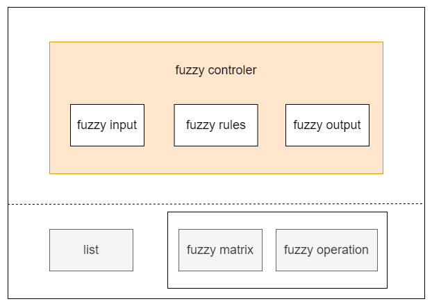

# 模糊控制算法——C语言版本

此工程为C语言版本的模糊控制算法，我将在这里提供模糊控制算法的核心及相关的示例项目。

- [模糊控制算法——C语言版本](#模糊控制算法c语言版本)
  - [1. 工程框架](#1-工程框架)
    - [1.1 数据结构](#11-数据结构)
      - [1.1.1 模板式单向链表](#111-模板式单向链表)
        - [谓词和事件回调函数指针](#谓词和事件回调函数指针)
        - [默认谓词和回调函数](#默认谓词和回调函数)
        - [链表操作API](#链表操作api)
        - [链表节点操作API](#链表节点操作api)
        - [参数获取API](#参数获取api)
      - [1.1.2 模糊运算](#112-模糊运算)
    - [1.2 算法核心框架](#12-算法核心框架)
      - [1.2.1 模糊输入](#121-模糊输入)
      - [1.2.2 模糊推理](#122-模糊推理)
        - [规则库](#规则库)
      - [1.2.3 模糊输出](#123-模糊输出)
    - [1.3 算法外围框架](#13-算法外围框架)
      - [1.3.1 输入数据模糊化](#131-输入数据模糊化)
      - [1.3.2 输出数据清晰化](#132-输出数据清晰化)

## 1. 工程框架

### 1.1 数据结构

#### 1.1.1 模板式单向链表

模板式单向链表能够存放各种类型的数据，在实际结构中使用`void* data`指针进行管理。

    struct list
    {
        void *data;
        struct list *next;
    };

由于`list.data`是`void*`类型，没办法在指针库中对数据进行更多的操作，因此需要使用时传入谓词或事件回调函数等对数据进行操作。

库中链表的操作函数如下：

##### 谓词和事件回调函数指针

| 名称 | 参数 | 返回值 | 描述 |
| - | - | - | - |
| list_pred | list_node,void* | bool | 谓词，通常用于确定是否是指定节点，也可对节点数据进行操作 |
| list_node_data_construct_cb | void* | bool | 节点参数构造函数 |
| list_node_data_deconstruct_cb | void* | bool | 节点参数析构函数 |
| list_event_cb | list_node,void* | bool | 事件回调函数，可用于操作节点参数 |

##### 默认谓词和回调函数

| 名称 | 参数 | 返回值 | 描述 |
| - | - | - | - |
| list_pred_true | list_node,void* | bool | 默认真谓词 |
| list_pred_false | list_node,void* | bool | 默认假谓词 |

##### 链表操作API

| 名称 | 参数 | 返回值 | 描述 |
| - | - | - | - |
| list_create | - | list_head | 创建链表句柄（头节点） |
| list_clear | list_head,list_node_data_deconstruct_cb | bool | 清空链表中的节点 |
| list_delete | list_head,list_node_data_deconstruct_cb | bool | 删除链表（包括链表中的节点和链表头节点） |
| list_length | list_head | list_index | 获取链表长度（链表中的节点数） |

##### 链表节点操作API

| 名称 | 参数 | 返回值 | 描述 |
| - | - | - | - |
| list_node_is_on_list | list_head,list_node | bool | 判断节点是否在链表上 |
| list_find_prev_node | list_head,list_node | list_node | 查找链表中指定节点的前一个节点 |
| list_find_next_node | list_head,list_node | list_node | 查找链表中指定节点的后一个节点 |
| list_push | list_head,void*,size_t | bool | 向链表的尾部追加一个节点 |
| list_pop | list_head | bool | 将链表末尾的节点删除 |
| list_find_if | list_head,void*,list_pred | list_node | 在链表中查找符合条件的第一个节点 |
| list_push_if | list_head,void*,size_t,list_pred,list_node_data_construct_cb | bool | 向链表的尾部追加一个节点，要求追加节点前的链表的最后一个节点满足谓词的要求，如果需要构造节点数据，则需传入构造函数指针 |
| list_pop_if | list_head,void*,list_pred,list_node_data_deconstruct_cb | bool | 将链表末尾的节点删除，要求删除节点前的链表的最后一个节点满足谓词的要求，如果需要析构节点数据，则需传入析构函数指针 |
| list_remove_if | list_head,void*,list_pred,list_node_data_deconstruct_cb | bool | 移除链表中符合谓词要求的节点，要求将被删除的节点链接在链表中，如果需要析构节点数据，则需传入析构函数指针 |
| list_swap_if | list_head,void*,void*,list_pred,list_pred | bool | 交换两个节点的逻辑位置，要求两个节点都在链表中，特殊地，要求交换的节点是链表中的同一个节点也能交换 |
| list_trav | list_head,void*,list_event_cb | bool | 遍历链表中的节点，并通过事件回调函数执行用户操作 |

##### 参数获取API

| 名称 | 参数 | 返回值 | 描述 |
| - | - | - | - |
| list_get_first_node | list_head | list_node | 获取链表中的第一个节点，如果链表是空的，则返回`nullptr` |
| list_get_last_node | list_head | list_node | 获取链表中的最后一个节点，如果链表是空的，则返回`nullptr` |
| list_get_node_data | list_head,list_index | void* | 获取指定索引处节点的数据 |
| list_get_node_data_if | list_head,void*,list_pred | void* | 获取满足谓词描述的节点的数据 |

#### 1.1.2 模糊运算

模糊运算是进行模糊推理的基础，在这里，仅讨论对模糊矩阵的运算。

为了实现模糊矩阵运算，首先得有一个表示模糊矩阵的数据类型：

    /**
    * @brief Fuzzy matrix
    * 
    * @memberof mat matrix 
    * @memberof row matrix rows
    * @memberof col matrix columns
    */
    struct fuzzy_matrix
    {
        fuzzy_number** mat;
        fuzzy_size row;
        fuzzy_size col;
    };

该数据类型使用二维指针对模糊矩阵进行管理，因此涉及到了动态内存分配，这是很危险的，所以我们需要将危险放在模块中，尽量避免使用者造成内存泄漏，我创建了以下几个函数，用于管理模糊矩阵。

| 名称 | 参数 | 返回值 | 描述 |
| - | - | - | - |
| fuzzy_matrix_init | struct fuzzy_matrix* | bool | 初始化模糊矩阵，尽可能地使用此函数来初始化，而不是手动初始化，因为未来升级后，初始化配置可能被更改，如果使用此函数，将不会发生问题 |
| fuzzy_matrix_create | struct fuzzy_matrix*,fuzzy_size,fuzzy_size | bool | 创建指定行数和列数矩阵，同时每个元素初始值设置为0（每个bit为0） |
| fuzzy_matrix_reshape | struct fuzzy_matrix*,fuzzy_size,fuzzy_size | bool | 使用 `realloc` 重新申请矩阵，存在损毁矩阵的风险，如果传入空矩阵，将会被降级成 `create` |
| fuzzy_matrix_reshape_s | struct fuzzy_matrix*,fuzzy_size,fuzzy_size | bool | 更加安全的 `reshape` ,如果传入空矩阵，将会被降级成 `create` |
| fuzzy_matrix_clear | struct fuzzy_matrix* | bool | 将矩阵中的每个元素都设置成0（每个bit都是0） |
| fuzzy_matrix_pay_tribute | struct fuzzy_matrix*,struct fuzzy_matrix* | bool | 纳贡函数，皇帝为表示尊敬，将自己清空以接收贡品，藩属国上贡后将失去贡品的掌控权 |
| fuzzy_matrix_rob | struct fuzzy_matrix*,struct fuzzy_matrix* | bool | 抢夺函数，国王觊觎勇者的战利品，如果没有战利品，勇者将被逐出宫殿，有战利品的话，即使是残缺的，国王也会去抢夺，然后丢掉自己的东西。殊不知，如果国王抢夺勇者的残缺的战利品，勇者将会和他同归于尽 |
| fuzzy_matrix_delete | struct fuzzy_matrix* | bool | 销毁创建的矩阵，注意不要将未创建矩阵且mat成员不为nullptr的参数传递给该函数，否则将会发生严重错误 |
| fuzzy_matrix_copy | struct fuzzy_matrix*,struct fuzzy_matrix* | bool | 将源模糊矩阵深拷贝至目标模糊矩阵，如果两个矩阵的维度不一致，将会销毁目标矩阵并创建一个维度一致的矩阵，然后复制源矩阵中元素的值 |
| fuzzy_matrix_copy_just_elem | struct fuzzy_matrix*,struct fuzzy_matrix*,fuzzy_size,fuzzy_size | bool | 仅赋值对应位置的元素的值，不改变其他位置的元素，也不动内存，可以设置行偏移值和列偏移值 |
| fuzzy_matrix_horzcat | struct fuzzy_matrix*,struct fuzzy_matrix*,struct fuzzy_matrix* | bool | 对两个矩阵进行横向拼接，如果以自己为模板或者没有给拼接模板，则以自己为拼接模板进行拼接（要求自己的矩阵已被创建），将会在函数中深度拷贝一份作为模板。注意，如果拼接失败，且问题不在于销毁dst之后申请内存失败或复制元素值失败，则会保留 `dst` |
| fuzzy_matrix_vertcat | struct fuzzy_matrix*,struct fuzzy_matrix*,struct fuzzy_matrix* | bool | 对两个矩阵进行纵向拼接，如果以自己为模板或者没有给拼接模板，则以自己为拼接模板进行拼接（要求自己的矩阵已被创建），将会在函数中深度拷贝一份作为模板。注意，如果拼接失败，且问题不在于销毁dst之后申请内存失败或复制元素值失败，则会保留 `dst` |
| fuzzy_matrix_repmat | struct fuzzy_matrix*,struct fuzzy_matrix*,fuzzy_size,fuzzy_size | bool | 将矩阵堆叠，如果以自己为模板或者没有给堆叠模板，则以自己为堆叠模板进行堆叠（要求自己的矩阵已被创建），将会在函数中深度拷贝一份作为模板。注意，如果堆叠失败，且问题不在于销毁dst之后申请内存失败，则会保留 `dst` |
| fuzzy_matrix_trav | struct fuzzy_matrix*,void*,fuzzy_opera_event_cb | bool | 遍历矩阵，并对矩阵的每个元素的值执行事件，不会改变矩阵中元素的值 |
| fuzzy_matrix_print | struct fuzzy_matrix*,const char* | - | 打印出矩阵中每个元素的值 |

除了这些对模糊矩阵内存的操作以外，还需要对模糊矩阵进行运算。

| 名称 | 参数 | 返回值 | 描述 |
| - | - | - | - |
| fuzzy_opera_trans | struct fuzzy_matrix*,struct fuzzy_matrix* | bool | 模糊矩阵转置，如果以自己为模板或者没有给转置模板，则以自己为转置模板进行转置（要求自己的矩阵已被创建），将会在函数中深度拷贝一份作为模板。注意，如果转置失败，且问题不在于销毁matT之后申请内存失败，则会保留 `matT` |
| fuzzy_opera_dir_pro | struct fuzzy_matrix*,struct fuzzy_matrix*,struct fuzzy_matrix* | bool | 求模糊矩阵的直积。相比于 `fuzzy_opera_dir_pro_s` 多了一个申请按行展开的矩阵的转置的过程，可能会申请失败，其算法通过调用 `fuzzy_opera` 实现，如果以自己为模板或者没有给转置模板，则以自己为转置模板进行转置（要求自己的矩阵已被创建），将会在函数中深度拷贝一份作为模板。 |
| fuzzy_opera_dir_pro_s | struct fuzzy_matrix*,struct fuzzy_matrix*,struct fuzzy_matrix* | bool | 求模糊矩阵的直积。注意，如果直积失败，且问题不在于销毁result之后申请内存失败，则会保留 `result` ，算法在函数内部实现 |
| fuzzy_opera | struct fuzzy_matrix*,struct fuzzy_matrix*,struct fuzzy_matrix* | bool | 实现矩阵的模糊运算，如果模糊运算失败，且问题不在于销毁result之后申请内存失败，则会保留 `result` |

### 1.2 算法核心框架

算法核心框架图如下：

核心需要使用链表和一些基本的模糊矩阵及其运算，在它们的基础之上，搭建起模糊控制器，其包括输入输出和推理三大功能。

#### 1.2.1 模糊输入

模糊输入部件需要记录单个论域的不同模糊子集，我将论域的名称称为 `名字` ，将模糊子集的名称称为 `标签` ，它们组成一对名字——标签对，用于后续辨别各个模糊子集，另外呢，它还需要能够实现将精确值模糊化的功能，因此我添加了一个模糊化函数，其相关API如下：

| 名称 | 参数 | 返回值 | 描述 |
| - | - | - | - |
| fc_input_register | struct fc_input* const,const char* | bool | 注册一个模糊输入对象，其名字是动态申请的（防止被意外修改），同时初始化模糊矩阵，并创建一个空链表。注意已经注册过的对象执行此函数，否则会发生内存泄漏 |
| fc_input_unregister | struct fc_input* const | bool | 注销模糊输入对象 |
| fc_input_add_fuzzy_set | const struct fc_input* const,const struct fuzzy_set* | bool | 向模糊输入对象添加一个模糊子集，其标签是动态申请的（防止被意外修改） |
| fc_input_clear_fuzzy_set | const struct fc_input* const | bool | 清空模糊输入中的模糊子集，即清空链表 |
| fc_input_fuzzing | struct fc_input* const,accurate_number*,fc_size | bool | 进行模糊化 |
| fc_input_print_data | struct fc_input* const,const char* | bool | 打印经过模糊化后的数据 |
| fc_input_print_fuzzy_set | struct fc_input* const,const char* | bool | 打印模糊输入对象中的模糊子集，以名字——标签对的形式进行打印 |

#### 1.2.2 模糊推理

##### 规则库

规则库的实现是模糊推理的关键一步，我希望有一个方便用户使用、能够较为轻松解析的规则实现，借助于先前编写的 [`StreamDeviceAT`](https://www.github.com/nayooooo/StreamDeviceAT)，决定使用字符串作为规则条目，并附加一些规则编写规范，那么就能轻松解析了。

现在对具体需求进行分析，首先，需要制定规则编写规范，我希望的规则是下面这样的：

    "IF A1 AND B2 OR C3 THEN U8"

上述规则中存在关键词 `IF` 、 `AND` 、 `OR` 、 `THEN` ，这些关键词需要保留，用户不能将其作为输入和输出的名称及标签，不过其中的输入和输出并不好区分哪一部分是名称，那一部分是标签，需要进一步设计：

    "IF A-1 AND B-2 OR C-3 THEN U-8"

现在我们就可以很好地区分名称和标签了，接下来的问题就是怎么设计多输出呢，多输出的各个输出之间并没有关系，无法使用 `AND` 或者 `OR` 对其进行辨别，因此我选择再添加一个关键词 `|` ，其使用方法如下：

    "IF A-1 AND B-2 OR C-3 THEN U-8 | V-9"

为了方便后续修改，我将关键词以静态常量数组的方式标记出来：

    static const fc_rule_keyword __fc_rules_keyword_table[] = {
        "IF", "THEN",            // conditional segmentation keywords
        "AND", "OR",             // conditional relationship keywords
        "?",                     // conditional ignore keywords
        "|",                     // multiple output annotations for results
    };

至此，规则条目的编写规范便已确定，接下来需要设计规则管理结构体了。

    /**
     * @brief The rule controller
     * 
     * @memberof rule_keyword_table
     * @memberof rule_keyword_num
     * @memberof rules rule library
     */
    struct fc_rules
    {
        const fc_rule_keyword* rule_keyword_table;
        fc_size rule_keyword_num;

        list_head rules;
    };

使用指针访问关键词组，节省内存空间、方便管理，规则条目则使用链表进行存储，便于随时添加，链表中存放的规则是一个个字符串。

与之相关的规则对象的注册、注销，添加、清空规则等功能函数简介如下：

| 名称 | 参数 | 返回值 | 描述 |
| - | - | - | - |
| fc_rules_register | struct fc_rules* const | bool | 注册一个规则管理对象，注册时会将关键词组的指针赋予对象，同时为其创建一个空链表。注意不要对已经注册过的对象使用该函数，否则将造成内存泄漏 |
| fc_rules_unregister | struct fc_rules* const | bool | 注销一个规则管理对象，因为对象的链表中存放的数据是字符串，所以不需要对数据进行析构 |
| fc_rules_add_rule | const struct fc_rules* const,fc_rule_item | bool | 向规则管理对象中添加一条规则，添加的规则须符合相关规范。注意到对象的链表中的规则条目并不是传入的规则条目，而是它的一个深度拷贝对象 |
| fc_rules_clear_rule | const struct fc_rules* const | bool | 清空规则管理对象中的规则，即清空链表 |
| fc_rules_get_rule_num | const struct fc_rules* const | fc_size | 获取规则管理对象中的规则数目 |
| fc_rules_print_rule | const struct fc_rules* const,const char* | bool | 打印规则管理对象中的所有规则 |

现在我能够使用规则管理对象管理我的规则，但是这些规则还是比较难处理的，我想要得到一个仅包含输入及其关系、输出内容的数据，为此我又设计了一个结构体：

    struct fc_calculation
    {
        list_head condition;
        list_head result;
    };

其中包含两个链表，分别用来表示输入（条件）和输出（结果），为了方便管理及后续扩展，我将这两个链表中存放的数据的结构设计成同一个：

    struct __fc_calculation_unit
    {
        fc_rule_consition_result cr;
        fc_rules_opera_type opera;
    };

这个结构中包括了输入/输出子集名称和对应的操作符，对于输入，目前有两个操作符，其分别是 $\vee$ 和 $\wedge$ 用来两者之间取大和取小。

对于这个计算式结构体（`struct fc_calculation`），我为其添加了如下几个操作函数：

| 名称 | 参数 | 返回值 | 描述 |
| - | - | - | - |
| fc_rules_create_calculation | struct fc_calculation* const | bool | 创建一个计算式对象，将会为对象创建两个空链表。注意不要对已经被创建的对象使用此函数，否则会发生内存泄漏 |
| fc_rules_export_calculation | struct fc_calculation* const,const struct fc_rules* const,const fc_index | bool | 从规则管理库中导出对应索引处的规则的计算式。注意，计算式中的字符串是通过动态申请获得的 |
| fc_rules_delete_calculation | struct fc_calculation* const | bool | 删除计算式 |
| fc_rules_print_calculation | const struct fc_calculation* const,const char* | bool | 打印出计算式 |

经过以上叙述，我们知道了规则库的功能是：

1. 管理规则库
2. 导出规则对应计算式

#### 1.2.3 模糊输出

### 1.3 算法外围框架

算法外围框架图如下：

#### 1.3.1 输入数据模糊化

#### 1.3.2 输出数据清晰化
